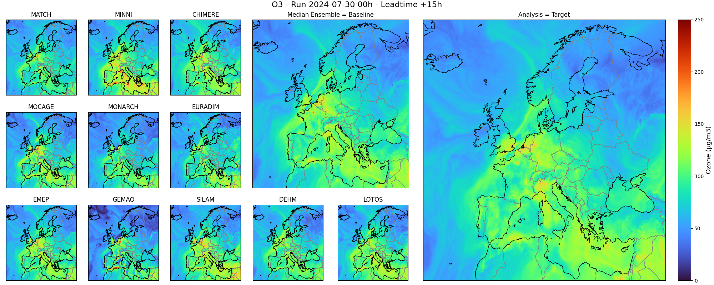

# tmp-cams-simple-preprocessing
Simplified CAMS deeplearning ensemble preprocessing script

## Installation

Be sure to have `git` and `git-lfs` installed then clone this project:
```sh
git clone https://github.com/meteofrance/tmp-cams-simple-preprocessing.git
```

Use the prepared `Dockerfile` to build the project's image:
```sh
docker build . -f Dockerfile -t tmp-cams-simple-preprocessing:latest
docker run -it tmp-cams-simple-preprocessing:latest uv run scripts/<script_name>.py
```

Otherwise, ensure to have the `eccodes` librairy installed on your system, and
use your prefered python installation method:

1. With uv:
    ```sh
    uv sync
    uv run scripts/<script_name>.py
    ```
2. With venv:
    ```sh
    python3.12 -m venv .venv
    source .venv/bin/activate  # On windows .venv/Scripts/Activate.ps1
    pip install .
    python scripts/<script_name>.py
    ```

## Preprocessing
Raw data can be processed with `python scripts/preprocessing.py`

## Plot data
Processed data can be plotted with `python scripts/plot.py`

## Dataset content
Data for this project is expected to be organized like so:
```txt
.
└── dataset
    ├── raw
    │   └── # raw data
    ├── processed
    │   └── # processed data
    ├── logs
    │   └── # training logs, generated by lightining
    └── species_stats.json  # Stats file with min, max, mean, used for normalization
```

### Raw data

A large amount of raw meteorological data is necessary to train the cams
deeplearning ensemble model. Here is a description of the dataset hierarchy,
and content.

The raw data is organized like so, with the following naming conventions:
- **`YYYY_MM_DD`** specifies a date ordered with year, month then day,
    spearated with `_` characters and zero padded on the left.
- **`LT`** = leadtime, a zero paded number between 0 and 96.
- **`LVL`** = level, one of 0, 50, 100, 250, 500, 750, 1000, 2000, 3000, 5000.
- **`SPECIESID`** = a species MF database id such as specified [here](data.md),
    without the suffix `_USI`.
- **`SPECIESNAME`** = a species ECMWF ADS id such as specified [here](data.md),
```txt
.
└── raw
    ├── ensemble
    │   └── SPECIESNAME
    │       └── YYYY_MM_LVLm.netcdf
    ├── PMACCCHIMERE
    │   └── YYYY_MM_DD_LT_LVL_SPECIESID.grib
    ├── PMACCDEHM
    │   └── YYYY_MM_DD_LT_LVL_SPECIESID.grib
    ├── PMACCEMEP
    │   └── YYYY_MM_DD_LT_LVL_SPECIESID.grib
    ├── PMACCEURADIM
    │   └── YYYY_MM_DD_LT_LVL_SPECIESID.grib
    ├── PMACCGEMAQ
    │   └── YYYY_MM_DD_LT_LVL_SPECIESID.grib
    ├── PMACCLOTOS
    │   └── YYYY_MM_DD_LT_LVL_SPECIESID.grib
    ├── PMACCMATCH
    │   └── YYYY_MM_DD_LT_LVL_SPECIESID.grib
    ├── PMACCMINNI
    │   └── YYYY_MM_DD_LT_LVL_SPECIESID.grib
    ├── PMACCMOCAGE
    │   └── YYYY_MM_DD_LT_LVL_SPECIESID.grib
    ├── PMACCMONARCH
    │   └── YYYY_MM_DD_LT_LVL_SPECIESID.grib
    └── PMACCSILAM
        └── YYYY_MM_DD_LT_LVL_SPECIESID.grib
```

Grib files in folders named with a CTM model name contain input data for 1 model
run, 1 leadtime, 1 species and all levels. Netcdf files in the `ensemble` folder
contain reanalysis (our target) data for a month, 2 level and 1 species.
`.grib` and `.netcdf` files can be opened using xarray like so:
```py
>>> import xarray as xr
>>> dataarray = xr.open_dataarray("PMACCCHIMERE/2023_07_27_15_O3.grib")
```

And quickly inspected with:
```py
$ uv run scripts/inspect_data.py 
-> breakpoint()
(Pdb) raw_input
<xarray.DataArray 'mdens' (latitude: 420, longitude: 700)> Size: 1MB
[294000 values with dtype=float32]
Coordinates:
  * latitude    (latitude) float64 3kB 71.95 71.85 71.75 ... 30.25 30.15 30.05
  * longitude   (longitude) float64 6kB -24.95 -24.85 -24.75 ... 44.85 44.95
    time        datetime64[ns] 8B ...
    step        timedelta64[ns] 8B ...
    surface     float64 8B ...
    valid_time  datetime64[ns] 8B ...
Attributes: (12/30)
    GRIB_paramId:                             400000
    GRIB_dataType:                            fc
    GRIB_numberOfPoints:                      294000
    GRIB_typeOfLevel:                         surface
    GRIB_stepUnits:                           1
    GRIB_stepType:                            instant
    ...                                       ...
    GRIB_name:                                Mass density
    GRIB_shortName:                           mdens
    GRIB_units:                               kg m**-3
    long_name:                                Mass density
    units:                                    kg m**-3
    standard_name:                            unknown
(Pdb)
(Pdb)
(Pdb) raw_target
<xarray.DataArray 'o3' (time: 720, lat: 420, lon: 700)> Size: 847MB
[211680000 values with dtype=float32]
Coordinates:
  * time     (time) datetime64[ns] 6kB 2023-04-01 ... 2023-04-30T23:00:00
  * lat      (lat) float64 3kB 30.05 30.15 30.25 30.35 ... 71.75 71.85 71.95
  * lon      (lon) float64 6kB -24.95 -24.85 -24.75 -24.65 ... 44.75 44.85 44.95
Attributes:
    standard_name:  mass_concentration_of_ozone_in_air
    long_name:      mass concentration of ozone
    units:          µg/m3
    source:         mass concentration of ozone at 0 meters above the surface...
(Pdb) processed_input
<xarray.DataArray 'mdens' (model: 11, latitude: 420, longitude: 700)> Size: 13MB
[3234000 values with dtype=float32]
Coordinates:
  * model      (model) <U7 308B 'CHIMERE' 'DEHM' 'EMEP' ... 'MONARCH' 'SILAM'
  * latitude   (latitude) float64 3kB 71.95 71.85 71.75 ... 30.25 30.15 30.05
  * longitude  (longitude) float64 6kB -24.95 -24.85 -24.75 ... 44.85 44.95
    run_date   datetime64[ns] 8B ...
Attributes: (12/30)
    GRIB_paramId:                             400000
    GRIB_dataType:                            fc
    GRIB_numberOfPoints:                      294000
    GRIB_typeOfLevel:                         surface
    GRIB_stepUnits:                           1
    GRIB_stepType:                            instant
    ...                                       ...
    GRIB_name:                                Mass density
    GRIB_shortName:                           mdens
    GRIB_units:                               kg m**-3
    long_name:                                Mass density
    units:                                    kg m**-3
    standard_name:                            unknown
```

### Processed data
The raw data need to be processed before being usable for training.
Data processing can be done with:
```sh
python scripts/preprocessing.py
```

Once processing done, training ready data are ordered like so:
```txt
.
└── processed
    ├── input
    │  └── YYYY_MM_DD.netcdf
    └── target
      └── YYYY_MM_DD_HH.netcdf
```

Processed data can be inspected with `python scripts/data/inspect_data.py` or 
opened like so:
```py
$ uv run scripts/inspect_data.py 
-> breakpoint()
(Pdb) processed_input
<xarray.DataArray 'mdens' (model: 11, latitude: 420, longitude: 700)> Size: 13MB
[3234000 values with dtype=float32]
Coordinates:
  * model      (model) <U7 308B 'CHIMERE' 'DEHM' 'EMEP' ... 'MONARCH' 'SILAM'
  * latitude   (latitude) float64 3kB 71.95 71.85 71.75 ... 30.25 30.15 30.05
  * longitude  (longitude) float64 6kB -24.95 -24.85 -24.75 ... 44.85 44.95
    run_date   datetime64[ns] 8B ...
Attributes: (12/30)
    GRIB_paramId:                             400000
    GRIB_dataType:                            fc
    GRIB_numberOfPoints:                      294000
    GRIB_typeOfLevel:                         surface
    GRIB_stepUnits:                           1
    GRIB_stepType:                            instant
    ...                                       ...
    GRIB_name:                                Mass density
    GRIB_shortName:                           mdens
    GRIB_units:                               kg m**-3
    long_name:                                Mass density
    units:                                    kg m**-3
    standard_name:                            unknown
(Pdb)
(Pdb)
(Pdb) processed_target
<xarray.DataArray '2023_04_01_00 reanalisis' (latitude: 420, longitude: 700)> Size: 1MB
[294000 values with dtype=float32]
Coordinates:
  * latitude    (latitude) float64 3kB 71.95 71.85 71.75 ... 30.25 30.15 30.05
  * longitude   (longitude) float64 6kB -24.95 -24.85 -24.75 ... 44.85 44.95
    valid_date  datetime64[ns] 8B ...
Attributes:
    standard_name:  mass_concentration_of_ozone_in_air
    long_name:      mass concentration of ozone
    units:          µg/m3
    source:         mass concentration of ozone at 0 meters above the surface...
```

Processed data can be represented with the `plot.py` script:
```sh
python scripts/plot_sample.py --date YYYYMMDDLT
```



</br></br></br></br></br>

---


